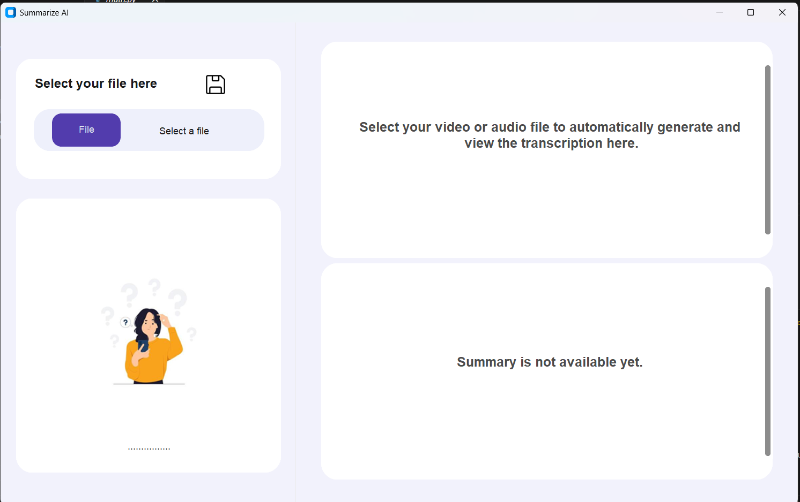

# 🧠 Summarize AI

**Summarize AI** is an intelligent and user-friendly audio/video/text summarization desktop tool built using `Python` and `CustomTkinter`.  
It uses **Vosk** (offline) for transcription and **Gemini flash2.0** (online) for accurate summarization and keyword extraction.

  

---

## 🚀 Features

- 🎥 Extract audio from video (MP4)
- 🎙️ Transcribe audio files (WAV, MP3)
- 📄 Summarize plain text files
- 🤖 Google Gemini AI-based summary and top 5 keywords
- 🧵 Multithreaded transcription for fast processing
- 💾 Auto-save transcribed text and summary
- 🖼️ Dynamic GUI with processing indicators

---

## 🖥️ UI Screenshots

 | .png) | 
---

## 🛠️ Requirements

- Python 3.9 or above
- FFmpeg (included as `./ffmpeg.exe`)
- Internet (only for summary generation)
